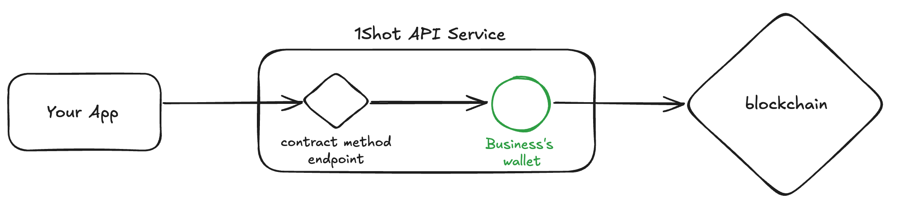
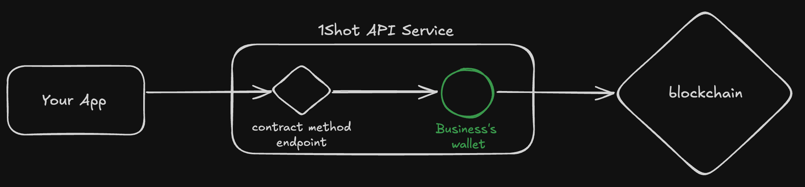
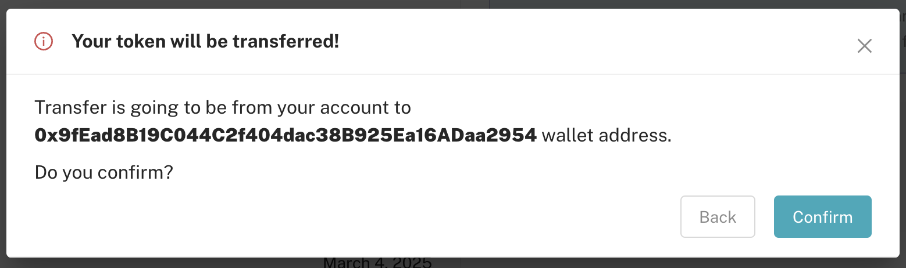

Escrow Wallets
======================

.. raw:: html

    

Escrow wallets are Ethereum-compatible signing keys managed by 1Shot to submit transactions on your behalf when you make a REST 
call to one of your configured `transaction endpoints <transactions.html>`_. Each of your escrow wallets can be linked to one or 
more transaction endpoints (but each endpoint can only have a single escrow wallet). In order to submit a transaction from any 
of your 1Shot-managed escrow wallets, you must first deposit gas tokens.

1Shot's hot wallet infrastructure keeps your keys secure and encrypted at rest, but it is still good practice to only deposit 
the amount of gas tokens you need for a given period of time. When your wallet runs low on funds, 1Shot will automatically send 
you an email notification. You can `deposit additional gas funds <#funding-your-escrow-wallet>`_ into your escrow wallet 
at anytime which will trigger a confirmation email when 1Shot detects the deposit.

Creating an Escrow Wallet
--------------------------

.. image:: ./_static/escrow-wallet/escrow-wallets-getting-started.png
   :alt: Creating your first escrow wallet
   :align: center

.. raw:: html

    
   
To create an escrow wallet, navigate to the `Escrow Wallets <https://app.1shotapi.com/escrow-wallets>`_ page in the 1Shot dashboard 
and click the "Create Wallet" button. You will be prompted to enter a name and description for your new wallet and the target blockchain 
the wallet will operate on.

.. _funding-your-escrow-wallet:

Funding Your Escrow Wallet
---------------------------

You must deposit native tokens into your escrow wallet to pay for transactions signed by its key. Only fund your escrow wallet with 
assets on the target blockchain the wallet is configured for. 

For example, if you are setting up an escrow wallet for the Ethereum mainnet, you should only deposit ETH to pay for gas into the 
wallet. If you are configuring a wallet for the Polygon network, you should only deposit Polygon gas tokens into the wallet.

.. hint:: 
   
   You can deposit ERC-20 tokens into an escrow wallet to make it easier to perform airdrops or DeFi trads. Another strategy would be to leave
   the tokens in a cold (or soft wallet) that you control and `approve <https://eips.ethereum.org/EIPS/eip-20#approve>`_ the 1Shot escrow wallet to spend them when needed.

Withdrawing funds
-----------------

.. image:: ./_static/escrow-wallet/withdraw.png
   :alt: Initiate funds withdrawal
   :align: center

.. raw:: html

    

You can withdraw funds from your escrow wallet at any time by clicking the "Withdraw" button on the wallet's detail page. Enter the amount of gas (native)
tokens you want to withdraw and click "Send". You'll be prompted to confirm the withdrawal details before the transaction is submitted.

