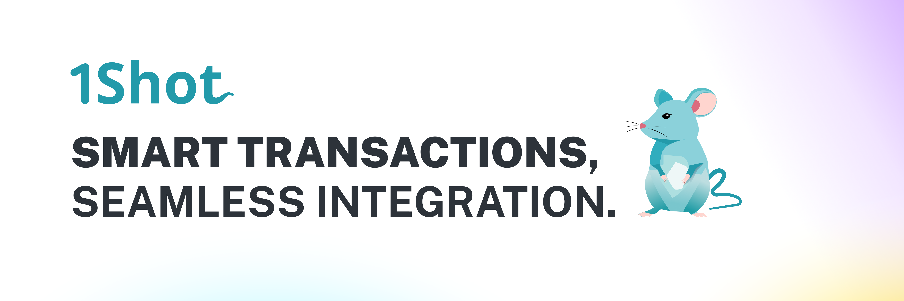
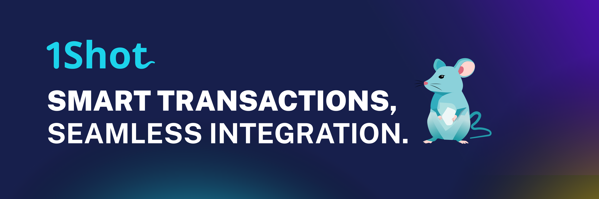

.. 1shot-documentation documentation master file, created by
   sphinx-quickstart on Wed Feb 12 19:54:45 2025.
   You can adapt this file completely to your liking, but it should at least
   contain the root `toctree` directive.

.. raw:: html

    

Welcome to 1Shot!
=================================

The `1Shot API <https://1shotapi.com>`_ is the first fully managed, enterprise-grade hot wallet and transaction service for the Ethereum mainnet and L2 ecosystem. 
It provides a simple REST API to trigger state-changing transactions on a target blockchain network with a single POST call. 

1Shot is designed to handle heavy user traffic. If your product has many users generating on-chain mechanics all at once, 1Shot ensures all of your transactions will 
make it to the chain quickly and gas efficiently. 1Shot greatly simplifies the technical overhead of adding digital assets or on-chain logic to any application, 
regardless of the language you application is written in.

Several helpful client sdks for popular languages like Python, Typescript, C#, and PHP are available so you can one shot your next app in no time,
leaving the complexities of transaction submission and monitoring to us.

Getting Started
----------------------------------

You can start using 1Shot by making an account at `app.1shotapi.com <https://app.1shotapi.com>`_. Here are the main features you can use to get started:

.. grid:: 2 2 2 2
    :gutter: 4

    .. grid-item-card:: 1. Organization Management 🏢
        :link: org-creation.html
        :link-alt: Organization Management 

        Create an organization, add team members, and manage billing.

    .. grid-item-card:: 2. Escrow Wallets 👛
        :link: escrow-wallets.html
        :link-alt: Escrow Wallets

        Provision and fund escrow wallets for submitting transactions.
   
    .. grid-item-card:: 3. Transaction Configuration 📝
        :link: transactions.html
        :link-alt: Transaction Configuration

        Build transaction endpoints to call smart contracts and configure webhooks.

    .. grid-item-card:: 4. Calling the 1Shot API 💻🐀
        :link: api.html
        :link-alt: Calling the 1Shot API

        Use your API key and secret to trigger transactions from your application.

.. toctree::
   :hidden:
   :maxdepth: 2

   org-creation
   escrow-wallets
   transactions
   api
