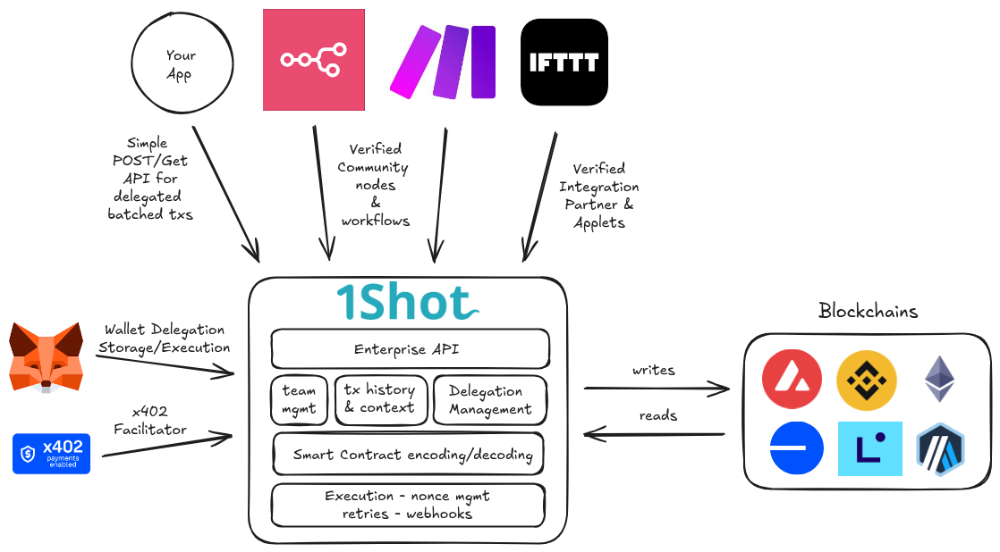

.. 1shot-documentation documentation master file, created by
   sphinx-quickstart on Wed Feb 12 19:54:45 2025.
   You can adapt this file completely to your liking, but it should at least
   contain the root `toctree` directive.

.. image:: ./_static/smart-tools-for-smart-contracts-dark.jpg
   :alt: 1Shot API
   :align: center
   :class: only-dark

.. raw:: html

    

Welcome to 1Shot API!
=====================

The `1Shot API <https://1shotapi.com>`_ is an automation-focused and enterprise-grade account abstraction and transaction service for the Ethereum mainnet and L2 ecosystem 
(Binance and Avalanche supported as well). It provides a simple REST API to trigger state-changing smart contract transactions (as well as smart contract reads) on a target blockchain network with 
a single POST call. 1Shot API can also be used in a completely non-custodial fashion by using its `delegation feature </basics/wallets.html#account-delegation>`_, allowing you to connect your self-custodied wallet to the 1Shot API service while retaining control over your private keys.

Architecture
------------

.. raw:: html

    

.. raw:: html

    

1Shot API is not an RPC provider, but an abstraction layer on top of typical RPC providers (like Infura, Alchemy or Ankr). In fact, depending on your use case you may not even need an RPC provider as we handle the full transaction lifecycle with real-time webhook callbacks on the final state of your transactions. 1Shot API allows you to read from and write to smart contracts without the need of importing web3 clients like viem or ethers.js into your source code. This lets you focus on the logic specific to your application while 1Shot API handles the complexities of data types, contract ABIs, signers and private key security, and nonce cohesion for you.

The 1Shot API service is designed to handle heavy request traffic. If your product has many users generating onchain actions all at once, 1Shot API ensures all of your transactions will make it to the chain quickly and gas efficiently. 1Shot API greatly simplifies the technical overhead of adding digital assets or on-chain logic to any application, bot, or agent, regardless of the language your application is written in. Additionally, with its powerful team & role management features, 1Shot API can scale with your product as your team and user base grows from proof-of-concept to enterprise scale.

Several helpful client sdks for popular languages like `Python <https://pypi.org/project/uxly-1shot-client/>`_, `Typescript <https://www.npmjs.com/package/@uxly/1shot-client>`_ are available so you can one shot your next app in no time, leaving the complexities of transaction submission and monitoring to us.

Onchain Automation
------------------

1Shot API is the best place to start for automating onchain workflows. We have integrations with the most popular automation platforms including:

.. grid:: 2
    :gutter: 2

    .. grid-item-card:: 1. n8n
        :link: /automation/n8n.html
        :link-alt: n8n
        :columns: 12

        .. image:: ./_static/automation/n8n.png
           :alt: n8n Logo
           :align: center
           :width: 400px

    .. grid-item-card:: 2. IFTTT 
        :link: /automation/ifttt.html
        :link-alt: If This Then That
        :columns: 6

        .. image:: ./_static/automation/ifttt.png
           :alt: IFTTT Logo
           :align: center
           :width: 300px

    .. grid-item-card:: 4. Make (formerly Integromat)
        :link: /automation/integromat.html
        :link-alt: Make (formerly Integromat)
        :columns: 6

        .. image:: ./_static/automation/integromat.png
           :alt: Make Logo
           :align: center
           :width: 300px

Facilitating x402 Payments
---------------------------

The `x402 <https://x402.org>`_ protocol is a payment scheme built around the `HTTP 402 <https://developer.mozilla.org/en-US/docs/Web/HTTP/Reference/Status/402>`_ status code that lets requesters pay for resources served by an API without the need for registration or traditional authentication. 1Shot API enables integration of x402 payments into your n8n, Make, or server application to accept any compatible ERC-20 token on any supported blockchain network. 

Check out our documentation for monetizing your `n8n </automation/n8n.html#monetize-n8n-workflows-with-x402>`_ & `Make </automation/integromat.html#monetize-make-scenarios-with-x402>`_ workflows with x402 payments for specific instructions for those platforms. See our `FastAPI example </api/examples/x402.html>`_ for a demonstration of how to put x402 into your server routes. 

1Shot Prompts
-------------

The 1Shot API lets AI agent developers consume smart contracts and their functions as fully annotated tools that can be consumed by any agent programming framework. You can 
find and publish smart contract tool prompts to `1Shot Prompts <https://app.1shotapi.com/1shotprompts>`_. This provides detailed prompts for the contract, function,
input and output parameter level which allow LLMs to better reason about how to plan transaction execution chains and what to expect from the behavior of a transaction
before planning or execution.

Getting Started
----------------------------------

Make a free 1Shot API account at `app.1shotapi.com <https://app.1shotapi.com>`_. Here are the core features you will use to get started with the 1Shot API:

.. grid:: 2 2 2 2
    :gutter: 2

    .. grid-item-card:: 1. Businesses and Teams 🏢
        :link: /basics/businesses-and-teams.html
        :link-alt: Businesses and Teams 

        Create a business, add team members, and manage billing.

    .. grid-item-card:: 2. Wallets 👛
        :link: /basics/wallets.html
        :link-alt: Wallets

        Provision and fund 1Shot API wallets for submitting transactions.
   
    .. grid-item-card:: 3. Calling Smart Contracts 📝
        :link: /basics/contract-methods.html
        :link-alt: Calling Smart Contracts

        Read from and write to smart contracts by importing their methods into your business's API.

    .. grid-item-card:: 4. Calling the 1Shot API 💻🐀
        :link: api/api.html
        :link-alt: Calling the 1Shot API

        Use your API key and secret to trigger transactions from your application.

.. toctree::
   :hidden:
   :maxdepth: 2

   basics/index.rst
   automation/index.rst
   prompts/index.rst
   api/index.rst
