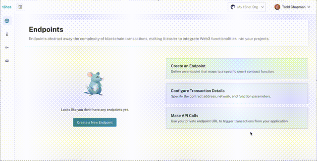
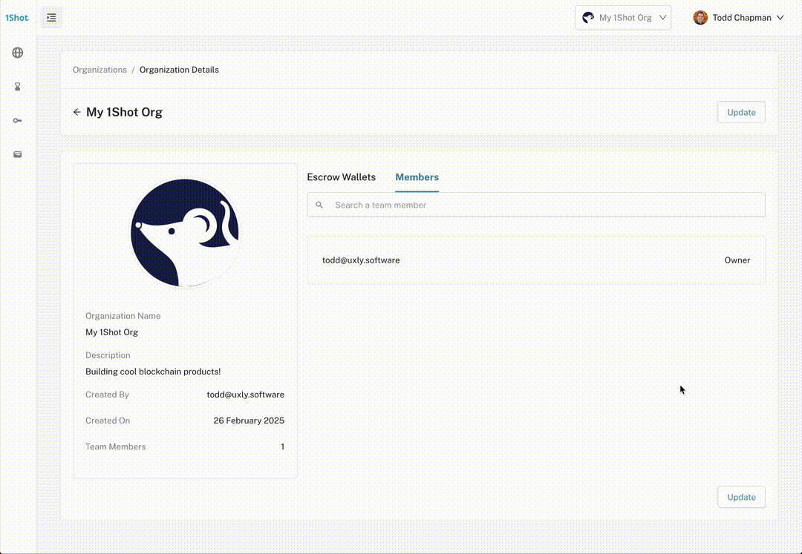

Organization Management
========================

Onboarding
--------------
.. image:: ./_static/org-creation/signup.png
   :alt: Sign up
   :align: center

.. raw:: html

    

The first step in using 1Shot is to create an organization. You will be prompted to do this on your fist sign in. 
An organization is a container for your projects and team members as well as billing. 

Creating New Organizations
--------------------------------

.. raw:: html

      

You can create new organizations by going to the "Organizations" tab in the 1Shot dashboard and clicking on the "Create Organization" button.
Escrow wallets and transaction endpoints are not shared between organizations and each organization has its own billing.

Member Management
-----------------

Once you have created an organization, you can add team members to it. Team members can be added by clicking on your profile icon in the top
right of the console and selecting "Organizations". This will take you to a page showing all organizations of which you are currently a member.
Click "Details" on the target organization you want to add a new member to. 

.. raw:: html

    

On the organization details page, first click "Update", then you will need to enter the email address of the team member and select their role. 
Finalize by clicking "Save". This will trigger an email notification to the new member that they have been given access to your organization.
You team members will be able to access your organization's projects and resources. Assign appropriate roles to team members in order to 
limit what actions they are allowed to perform within your organization.

