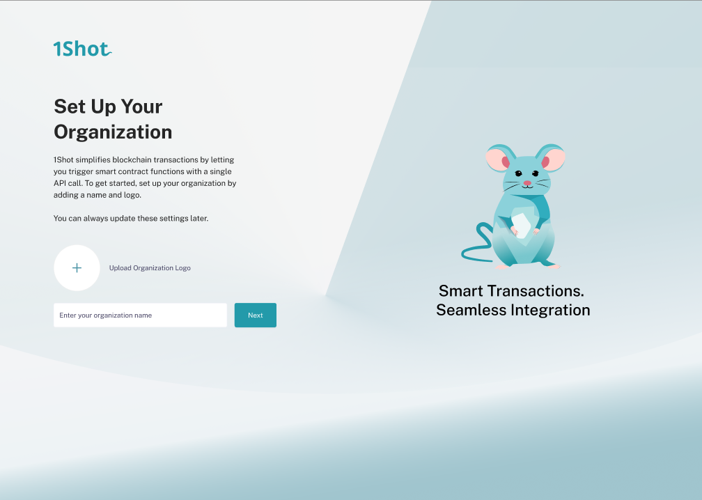

Creating an Organization
========================

The first step in using 1Shot is to create an organization. You will be prompted to do this on your fist sign in. An organization is a container for your projects and team members. 

.. list-table::
   :widths: 53 47
   :header-rows: 0

   * - .. image:: ./_static/org-creation/profile-icon.png
         :alt: Sign up
         :align: center
     - .. image:: ./_static/org-creation/orgs-page.png
         :alt: Sign up
         :align: center
You can create new organizations by going to the "Organizations" tab in the 1Shot dashboard and clicking on the "Create Organization" button. 

Once you have created an organization, you can add team members to it. Team members can be added by going to the "Team" tab in the 1Shot dashboard and clicking on the "Add Team Member" 
button. You will need to enter the email address of the team member you want to add, and they will receive an email notification that they have been given access to your organization.
You team members will be able to access your organization's projects and resources. You can also assign roles to team members, which will determine what actions they are allowed to 
perform within your organization.

